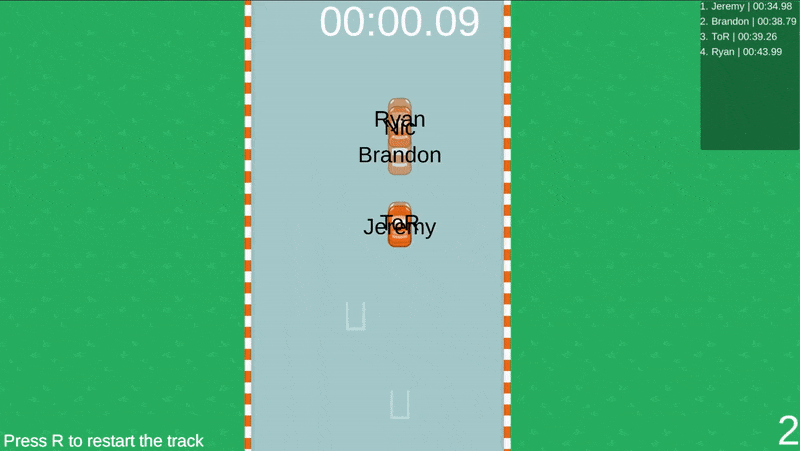

# Redis-Racing

#### Competitive web racing game powered by Redis
- The goal is to complete the track as fast as possible to set a time on the live public leaderboard, no sign up required.

Play the game at [jpasqui.dev/racing](https://jpasqui.dev/racing)

Created by: Graham Pinsent and Jeremy Pasquino




-------------
## How it works

Once a player selects their name and is connected to the server, their position on the map is sent to the redis database. As the player navagates through the track their position is being updated 10x/second. This is what the player data might look like: 
```json
"players" = {
    "_James" : {"name":"James","xPos":1,"yPos":10,"zRot":-90,"lastping": "2021-05-11T21:44:11.640Z"},
    "_Ryan" : {"name":"Ryan","xPos":20,"yPos":80,"zRot":180,"lastping": "2021-05-11T21:45:11.790Z"},
    "_Paul" : {"name":"Paul","xPos":-2,"yPos":180,"zRot":61,"lastping": "2021-05-11T21:45:15.110Z"}
}
```
Every time a player makes a post to the server with their new location, the response from the server includes all players current positions and data. This is then used to place everyone elses car on the track for you to see as you are driving. Linear interpolation is used to smooth the movement to make it look faster than 10 updates per second. 

Once a player crosses the finish line, their time and name is sent to the server. Example of track time data:

```json
"leaderboard" = {
    "_James" : {"name": "James","laptime": 37.19,"created": "2021-05-11T21:56:55.440Z"},
    "_Ryan" : {"name": "Ryan","laptime": 50.56,"created": "2021-05-11T21:57:35.220Z"},
    "_Paul" : {"name": "Paul","laptime": 45.11,"created": "2021-05-11T21:58:51.120Z"}
}
```
This data is used to create a live leaderboard for everyone to see as they race to get the fastest time possible. When any car in the game crosses the finish line, the client requests the new leaderboard data from the server. 

--------

## Features

#### Pick Name
When the player first starts the game, they are prompted with an option to choose their name. Once they enter their name and press start, the game client sends a POST request to the server with their name. The server then performs various checks on the name to validate it, including checking if the name is already taken. The server gets all players' json from the redis database and pushes it into an array to loop over, checking their name against the data.
```javascript
client.json_get("players", function (err, results) {
    const currentplayers = Object.values(JSON.parse(results))
    currentplayers.forEach(function (item, index){
        playernames.push(item.name)
    })
```
Finally, after the validation, the server sends a success response back to the client. If the name was invalid then it sends a failure response back.

#### Update Position

Once the player has spawned into the game, a POST request is sent to the server every tenth of a second. The request includes their name, position, and rotation. Once the server receives the request, it adds the current time into the JSON, then sets the JSON in the redis database.
```javascript
const namekey = `_${myjson.name}`
client.json_set("players",namekey, JSON.stringify(data))
```
Once the player's new position has been set, the server then gets all players' JSON from the redis database and sends it as a response back to the game client.
```javascript
client.json_get("players", function (err, results) {
    res.send(Object.values(JSON.parse(results)))
})
```
As soon as the game client receives the data, it can update all the connected players' positions.

#### Leaderboard

When a player finishes a lap, a POST request is sent to the server including their name and the time it took to finish the lap. The server first gets their old time from the redis database.
```javascript
const namekey = `_${myjson.name}`
client.json_get("leaderboard", `.${namekey}`, function (err, results) {
```
The server then checks if they had an old time or if this is the player's first lap time that they are submitting. If the player has an old time, then it compares it with the new time to see if it is faster. If it is faster, then it sets the new time into the leaderboard JSON in the database.
```javascript
if (oldtime) {
    oldtime = JSON.parse(oldtime)
    if (myjson.time < oldtime.laptime) {
        client.json_set("leaderboard", namekey, JSON.stringify(data))
    }
}
```
Otherwise, if it is their first time, then their name is set with their time into the leaderboard.
```javascript
else {
    client.json_set("leaderboard", namekey, JSON.stringify(data))
}
```
Finally, the server gets the entire leaderboard, and sends the response back to the game client.
```javascript
client.json_get("leaderboard", function( err, results) {
    res.send(Object.values(JSON.parse(results)))
})
```
The game client can then form the leaderboard with the data.

#### Remove Disconnected Players

Every thirty seconds, the server gets all players' JSON data from the redis database.
```javascript
client.json_get("players", function (err, results) {
```
When a player closes their game, the game client stops sending update position requests. The server loops through all players to check if their last update was more than thirty seconds ago. If it was, then they are deleted from both the players JSON and the leaderboard JSON.
```javascript
playerdata.forEach(function (item, index) {
  var namepath = `._${item.name}`
  var seconds = Math.floor((new Date() - Date.parse(item.lastping)) / 1000);
  if (seconds > 30) {
    client.json_del('players', namepath)
    client.json_del('leaderboard', namepath)
    console.log(`Removed ${item.name}`)
  }
});
```
The same check happens on the game client. If their last update was received more than 30 seconds ago, then their car object is destroyed.
```C#
if (lastPing.AddSeconds(30) < DateTime.Now) {
    isAFK = true;
    GameManager gameManager = GameObject.Find("GameManager").GetComponent<GameManager>();
    gameManager.StartGetLeaderboard();
    gameManager.RemovePlayer(this);
    Destroy(gameObject);
}
```

---------

## How to run locally

### In the nodejs folder:

#### Create .env file
```
HOST=RedisUrlHere
PASSWORD=RedisPasswordHere
```
This will hold your own redis database information

#### Install dependencies
```
npm install
```
#### Run server
``` 
node index.js
```
### Launch Unity project

You can either build the game, or just press play inside the project.
