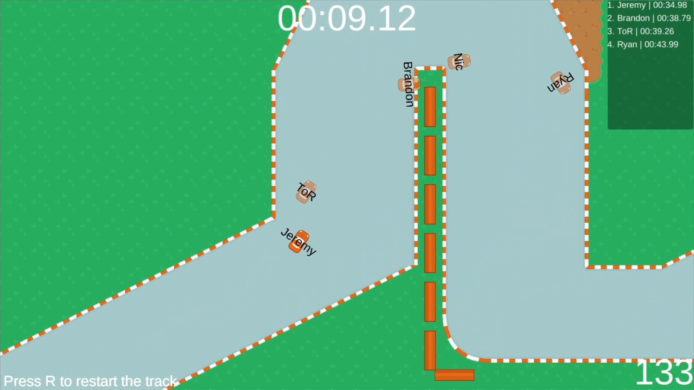

# Redis-Racing

#### Competitive web racing game powered by Redis
- The goal is to complete the track as fast as possible to set a time on the live public leaderboard, no sign up required.

Play the game at [jpasqui.dev/racing](https://jpasqui.dev/racing)

Created by: Graham Pinsent and Jeremy Pasquino





-------------
## How it works

Once a player selects their name and is connected to the server, their position on the map is sent to the redis database. As the player navagates through the track their position is being updated 10x/second. This is what the player data might look like: 
```json
"players" = {
    "_James" : {"name":"James","xPos":1,"yPos":10,"zRot":-90,"lastping": "2021-05-11T21:44:11.640Z"},
    "_Ryan" : {"name":"Ryan","xPos":20,"yPos":80,"zRot":180,"lastping": "2021-05-11T21:45:11.790Z"},
    "_Paul" : {"name":"Paul","xPos":-2,"yPos":180,"zRot":61,"lastping": "2021-05-11T21:45:15.110Z"}
}
```
Every time a player makes a post to the server with their new location, the response from the server includes all players current positions and data. This is then used to place everyone elses car on the track for you to see as you are driving. Linear interpolation is used to smooth the movement to make it look faster than 10 updates per second. 

Once a player crosses the finish line, their time and name is sent to the server. Example of track time data:

```json
"leaderboard" = {
    "_James" : {"name": "James","laptime": 37.19,"created": "2021-05-11T21:56:55.440Z"},
    "_Ryan" : {"name": "Ryan","laptime": 50.56,"created": "2021-05-11T21:57:35.220Z"},
    "_Paul" : {"name": "Paul","laptime": 45.11,"created": "2021-05-11T21:58:51.120Z"}
}
```
This data is used to create a live learboard for everyone to see as they race to get the fastest time possible. When any car in the game crosses the finish line, the client requests the new leaderboard data from the server. 

--------

## Features

#### Pick Name


#### Update Position


#### 


---------
## How to run locally

Create .env file
```
HOST= "redis url"
PASSWORD= "redis password
```

Run server

``` 
cd nodejs
npm run dev
```

Launch unity project
```
press play button
```
